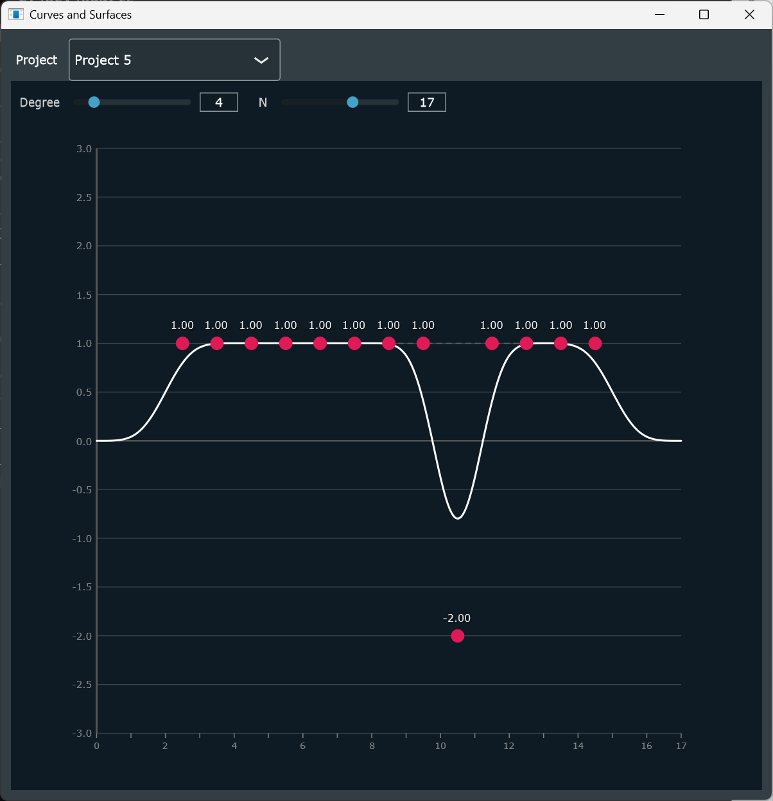
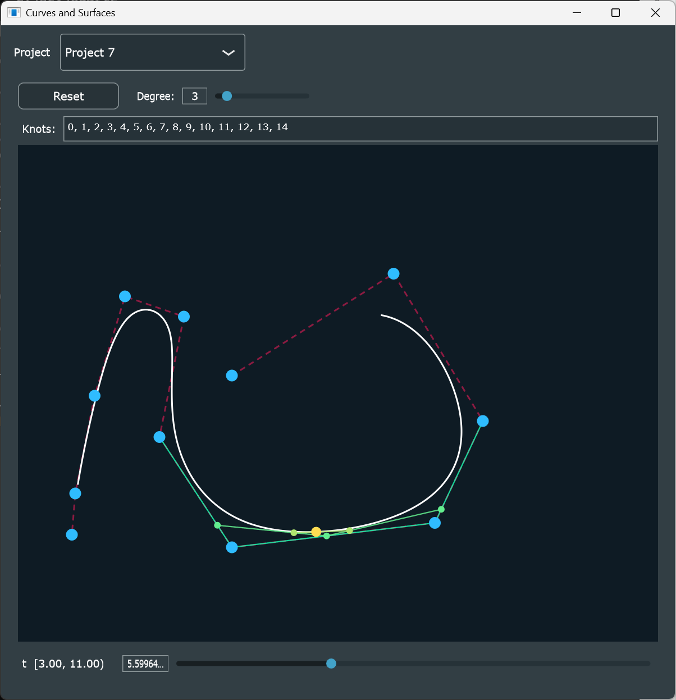
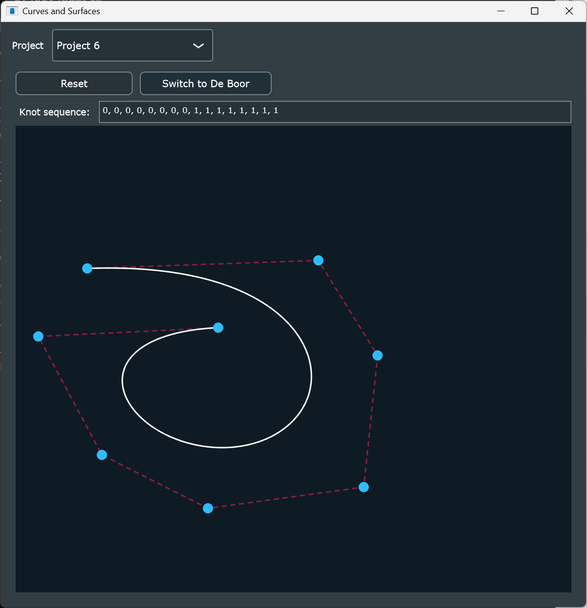
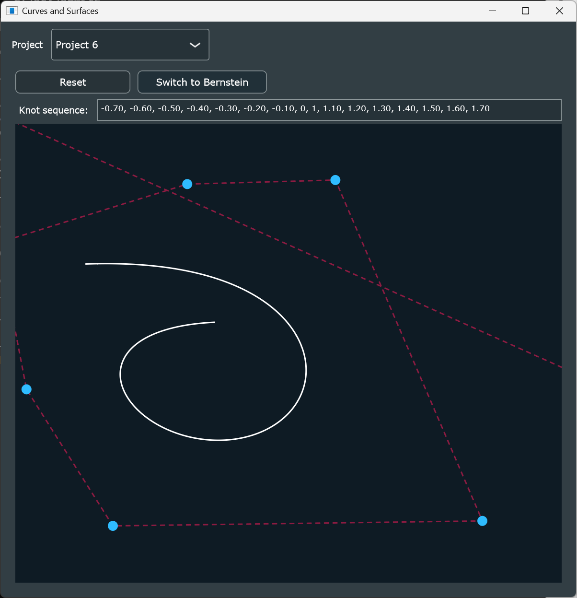
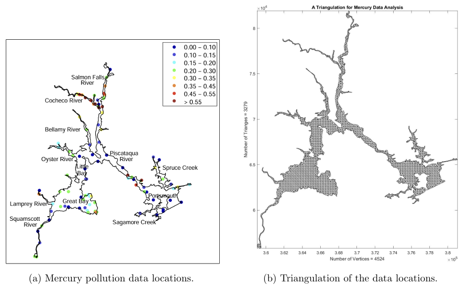

# Curves and Surfaces : A Recap
This has been a hard course. New topics were introduced without a clear answer to why: why are we learning this, how are they significant, how are they connected.

But now as I go back and review all I learned, I've got the whole picture. The whole course is to think of different methods to create a curve mathematically, in a way that is smooth, locally controllable, predictable, and computationally efficient.

## Problem With Basic Method
At the end of the day, a curve is represented as a polynomial. A simple curve is just a polynomial $p(t)$ that traces a path as $t$ moves from 0 to 1. To draw a curve that we want mathematically, we would define a few points(deemed control points) and find a $p(t)$ that connects those points. 

The basic way to describe such a curve would be using the standard basis: $\{1, t, t^2, ..., t^d\}$, therefore, $p(t) = a_0+a_1t+a_2t^2+...+a_dt^d$ for $d+1$ number of control points. But this method has two problems. One, it is expensive to compute. It requires solving the [[#Vandermonde|Vandermonde system]] via Gaussian elimination, which scales poorly as the number of points grows. Second, the coefficients of the standard basis have no geometric meaning; you cannot intuitively control the shape or predict how a change in the coefficient will affect the curve. 

## Bernstein Basis and Bézier Curves
So we consider a different basis, the Bernstein basis. The Bernstein basis polynomials of degree $n$ are defined as:

$$
B_i^d(t) = \binom{d}{i}(1-t)^{d-i}t^i
$$

The basis function is non-negative for $t\in[0,1]$ and adds up to one. This means we can blend control points using them as weights, and the resulting curve is guaranteed to stay inside the convex hull of those control points. This makes the curve predictable. And this basis become the building blocks for the Bézier Curve. 

The Bézier curve comes from a different idea: having the control points attract the curve instead of forcing the curve go through them. 
They are evaluated through blending the control points, which can be done with the De Casteljau Algorithm(a.k.a the Nested Linear Interpolation Algorithm) which repeatedly blends adjacent control points, or using the Bernstein basis:

$$
p(t)=\sum_{i=0}^dc_iB_{i}^d(t)
$$

  <figure>
    
    <figcaption>Nested Linear Interpolation</figcaption>
  </figure>
  <figure>
    
    <figcaption>Bernstein Basis</figcaption>
  </figure>
  <figure>
    
    <figcaption>Midpoint Subdivision</figcaption>
  </figure>

We still have two problems. One, because the Bézier curve is made of different weights between Bernstein, a control point has influence over the whole curve. When we have a complex shape we cannot change a segment without the whole curves being changed. Two, the curve doesn't touch the control point except for the two end points. 

Let's address the second problem first, and come back to the first one later.
## Interpolation
Interpolation introduces methods to produce a curve that goes through every control point. The polynomial interpolation problem takes the form:
Given distinct values $t_0,t_1,...,t_d$, and a data function $g(t)$, find $p(t)\in P_d$ satisfying: $p(t_i)=g(t_i)$ for all $i=0,..,d$. Which means if we have control points $(x_0,y_0),..,(x_d,y_d)$ and assign parameter values $t_0,...,t_d$, then we find two polynomials $p_x(t)$ and $p_y(t)$ such that $p_x(t_i) = x_i$ and $P_y(t_i) = y_i$ for all $i$.
### Vandermonde
The Vandermonde system is the system behind the standard basis approach. Given the interpolation conditions $p(t_i)=g(t_i)$ substituting $p(t)=c_0+c_1t +...+c_dt^d$ into each condition gives an equation per control point. We can make a linear system out of the equations and produce an augmented matrix that looks like this:
$$
\left(\begin{array}{ccccc|c}
1 & t_0 & t_0^2 & \cdots & t_0^d & g(t_0) \\
1 & t_1 & t_1^2 & \cdots & t_1^d & g(t_1) \\
1 & t_2 & t_2^2 & \cdots & t_2^d & g(t_2) \\
\vdots & \vdots & \vdots & \ddots & \vdots & \vdots \\
1 & t_d & t_d^2 & \cdots & t_d^d & g(t_d)
\end{array}\right)
$$
which as a matrix equation is equivalent to:
$$
\begin{pmatrix}
1 & t_0 & t_0^2 & \cdots & t_0^d \\
1 & t_1 & t_1^2 & \cdots & t_1^d \\
1 & t_2 & t_2^2 & \cdots & t_2^d \\
\vdots & \vdots & \vdots & \ddots & \vdots \\
1 & t_d & t_d^2 & \cdots & t_d^d
\end{pmatrix}
\begin{pmatrix}
c_0 \\ c_1 \\ c_2 \\ \vdots \\ c_d
\end{pmatrix}
=
\begin{pmatrix}
g(t_0) \\ g(t_1) \\ g(t_2) \\ \vdots \\ g(t_d)
\end{pmatrix}
$$
As long as all $t_i$​ are distinct, the determinant of $V$ is nonzero which proves that a unique solution always exists. We can find the coefficients $c_i$​ by solving this via Gaussian elimination. However, Gaussian elimination is $O(n^3)$. Add one more control point and the entire system needs to be solved from scratch.
### Lagrange
Lagrange offers a more explicit solution. Instead of solving a linear system, it constructs the interpolating polynomial directly.
For each $t_i$, define a basis polynomial $L_i(t)$ that is 1 at $t_i$ and 0 at every other $t_j$:

$$
L_i =\prod_{j\neq i} \frac{t-t_j}{t_i-t_j}
$$

Then the interpolating polynomials is just a weighted sum of these:

$$
p(t)=\sum_{i=0}^{d}g(t_i)\,L_i(t)
$$

So now we have a polynomial without going through expensive calculations. 
The problem is that each $L_i(t)$ is defined relative to all the other $t_j$ values. Adding one new control point will change all the basis polynomials and the curve has to be rebuilt from scratch. We need a more practical algorithm.

### Newton Form
Newton reorganizes the interpolating polynomial so that adding a new control point only requires one new term. This is done through divided differences**, defined recursively:

$$
[t_i]\,g = g(t_i)
$$

$$
[t_i, \ldots, t_{i+k}]\,g = \frac{[t_{i+1}, \ldots, t_{i+k}]\,g - [t_i, \ldots, t_{i+k-1}]\,g}{t_{i+k} - t_i}
$$

The interpolating polynomial is then:

$$
p(t) = \sum_{k=0}^d [t_0, \ldots, t_k]\,g \cdot N_k(t)
$$

where $N_k = \prod_{j=0}^{k-1}(t - t_j)$ is the $k$-th Newton basis polynomial. When we add a new control point, we only have to calculate a new divided difference and a new term. The order you add points doesn't change the final polynomial.

## The Problem With a Single Curve
We've looked at different solutions to draw a curve so far, and it works to some degree. However, Bézier curves and interpolation methods produce global curves. This means we cannot change a part of the curve without changing other parts of the curve as well. 
Also, for complex shapes we need many control points. For interpolation, adding more points makes the polynomial oscillate wildly just to satisfy all constraints at once.
<figure>
  
  <figcaption>High-degree interpolation oscillates between control points</figcaption>
</figure>
The fix for this is to put multiple curves together; this is called a spline.

But the moment we stitch curves together, a new question appears: how do we connect them? A curve is just a polynomial, and two polynomials meeting at a point don't automatically connect smoothly. We need to decide how they join. This is the concept of continuity.
## Continuity
When two curve pieces meet at a point, they can connect at different grades of smoothness. We describe this with continuity.
- $C^0$ : values match at the join
- $C^1$ : values and tangents match
- $C^2$ : values, tangents, and curvature all match
For most practical purposes such as car bodies and animation paths, $C^2$ is the target. We enforce this through **osculation**.
### Osculation
Enforcing continuity at a join means matching derivatives, and the framework for this is **osculation**. Two curves osculate at a point if they touch and share derivatives without crossing.

For Newton form, we achieve this by allowing repeated values in the divided difference table. A repeated value encodes a derivative condition. In this case the divided difference for repeated values follows a different formula. When $t_0 = t_d$:

$$
[t_0,t_1,...,t_d]g=\frac{g^{(d)}\,(t_0)}{d!}
$$

For Bézier curves, the segment itself is Hermite interpolation. The endpoint positions are specified explicitly, and the interior control points encode the tangent directions:

$$
\gamma'(0) = d\,(P_1 - P_0), \qquad \gamma'(1) = d\,(P_d - P_{d-1})
$$

This is derived from the Bernstein derivative formula $(B_i^d)' = d\,(B_{i-1}^{d-1} - B_i^{d-1})$. This is what enforces $C^1$ continuity when we chain two Bézier segments.

However, enforcing $C^2$ continuity between Bézier segments is possible but fragile. Every join requires manual bookkeeping, and moving one control point can break the continuity conditions at neighboring joins. The more segments we add, the more conditions we have to manage by hand.

A new topic B-Splines solve this. The smoothness at joins is guaranteed by the representation itself, not enforced externally.
## B-Splines
B-splines solve the locality problem by changing the basis. Instead of Bernstein basis functions, which are nonzero across the entire interval $[0,1]$, we introduce a basis that is nonzero only over a small window of the parameter domain and therefore impacts only the nearby portion of the curve responds.

The B-spline basis functions are defined as divided differences of the truncated power function:

$$
B_i^d(t) = (-1)^{d+1}(t_{i+d+1} - t_i)\,[t_i, \ldots, t_{i+d+1}]\,(t-x)^d_+
$$

### Knot Sequence
The knot sequence $t_0 \leq t_1 \leq \cdots \leq t_N$​ controls where each basis function lives and what continuity we get at each join. 
The distinct values in the sequence represents the endpoints and the breakpoints(the parameter where two curves join). The multiplicity(the number of times the value occurs) determines the continuity at that point. One knot gives $C^{d-1}$ continuity. Each repeated knot reduces the continuity by one. Repeating a knot $d+1$ times will make the curve pass through the control point with a sharp corner.

So the curve is smooth by default and we can sharpen it if needed.

<figure>
  
  <figcaption>B-spline basis functions over the knot sequence — moving one coefficient changes only the local region</figcaption>
</figure>
### De Boor Algorithm
A degree $d$ B-spline curve is written as:

$$
\gamma(t) = \sum_{i=0}^{N-d-1} B_i^d(t)\, P_i
$$

for some knot sequence $t=\{t_0,t_1,\ldots,t_N\}$ and control points $P_0,\ldots,P_{N-d-1}$ and $t$-values in the interval $[t_d,t_{N-d}]$. De Boor's algorithm directs us to find the sum without calculating all the basis. Only $d+1$ basis functions are nonzero at any given, so we only have to find the blend of the control points that actually participate.
The algorithm is as follows:
1. Find $J$ such that $t\in [t_J, t_{J+1}]$ => only the control points $P_{J-d}, \ldots, P_J$ participate
2. Set $P_i^{[0]} = P_i$.
3. for $k=1,...,d$:

    $$
    P_i^{[k]} = \frac{t_{i+d-k+1} - t}{t_{i+d-k+1} - t_i}\,P_{i-1}^{[k-1]} + \frac{t - t_i}{t_{i+d-k+1} - t_i}\,P_i^{[k-1]}
    $$

4. $\gamma(t) = P_J^{[d]}$

<figure>
  
  <figcaption>De Boor evaluation — only the nearby d+1 control points participate at each t</figcaption>
</figure>

## Polar Forms
Polar forms was introduced as a method to easily shift the curve's representation while preserving the shape. This is because every polynomial $f$ of degree $d$ has a unique symmetric multivariate version of itself, a function $F[u_1, \ldots, u_d]$ satisfying:

1. Symmetric: the order of arguments does not matter
2. Diagonal: $F[t, t, \ldots, t] = f(t)$
3. Affine in each argument

The control points of any B-spline curve are just the polar form evaluated at consecutive knot windows. The Bézier control points $P_0, \ldots, P_d$​ are:

$$
P_i = F[\underbrace{0, \ldots, 0}_{d-i},\underbrace{1, \ldots, 1}_{i}]
$$

This is why changing the knot sequence changes the control points but not the curve. The control points are polar form evaluations at knot windows. Changing the window will produce different points but it's still the same polynomial.

It also explains why de Casteljau and de Boor are the same algorithm. Both are doing NLI on the polar form at different argument tuples.

  <figure>
    
    <figcaption>Bernstein evaluation via polar form</figcaption>
  </figure>
  <figure>
    
    <figcaption>De Boor evaluation via polar form</figcaption>
  </figure>

## Multivariate Splines
At the end of the semester I wrote a short report on multivariate splines, based on a 2024 survey paper by Ming-Jun Lai. It was a good way to see where everything we learned is going.

Multivariate splines refers to splines that use more than a single parameter $t$ that we've been dealing with so far. It's most useful in scattered data fitting that needs multiple variables such as a terrain elevation map depends on latitude and longitude, or a temperature field inside an engine depends on three spatial coordinates.
The core idea of univariate splines doesn't change, just the knot sequence becomes a triangulation; a partition of the 2D domain into triangles each carrying its own polynomial piece. And the smoothness at the join is the smoothness at the shared edges of the triangle. It was very interesting to see how the concept expanded.

<figure>
  
  <figcaption>Triangulation of the Mercury Estuary domain</figcaption>
</figure>

## Conclusion
In all, it was quite a hectic journey, but it became a very interesting topic to learn once I got to know the bigger picture. It was satisfying to match the pieces once more as I wrote this post. Biggest thanks to [Freya Holmér](https://www.youtube.com/@acegikmo)'s video as that was the stimuli that helped me click in this topic.

And with that, I wish to be able to utilize this knowledge on my journey forward.

## References
- MAT 300/500 : Curves and Surfaces, Spring 2026. DigiPen Institute of Technology.
- Freya Holmér, [_Continuity of Splines_ ]([https://www.youtube.com/@acegikmo](https://youtu.be/jvPPXbo87ds?si=ayPGDlun84BV2Zvb))
- Ming-Jun Lai, _Multivariate Splines and Their Applications_, arXiv:2401.08423, 2024.